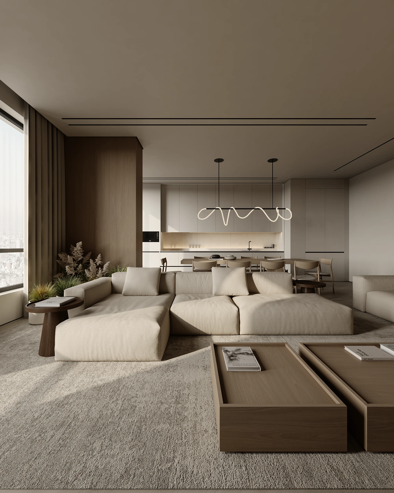

# 📐 MaterialCalc - Akıllı Malzeme Hesaplama Platformu



> **MaterialCalc**, mimarlar, iç mimarlar, ustalar ve evini yenileyenler için geliştirilmiş **Apple estetiğinde, minimalist ve ultra-hassas** bir web tabanlı inşaat/dekorasyon malzeme hesaplama platformudur.

---

## ✨ Temel Özellikler

- 💎 **Apple Glassmorphism & Dinamik Ada Tasarımı:** Üstün kullanıcı deneyimi sunan yüzen ada (floating dynamic island) menüsü ve tam ekran cam blur mobil menü.
- 📐 **5 Temel Malzeme Hesaplama Modülü:**
  - 🏺 **Seramik:** Kutu alanı, fire payı (%) ve milimetrik kutu adedi.
  - 🪵 **Parke:** Paket miktar hesabı ve köşe fire optimizasyonu.
  - 🎨 **Boya:** Metrekare, sarfiyat (m²/L) ve kat sayısına göre net litre hesabı.
  - 📜 **Duvar Kağıdı:** Duvar ölçüsü ve rulo ebatlarına göre tam rulo sayısı.
  - 📏 **Süpürgelik:** Oda çevresi, kapı boşluğu (0.9m düşümü) ve boy adedi.
- 🧮 **Şeffaf "Usta Hesabı" Matematiği:** Şantiyedeki gerçek ustalık standartlarına dayalı formüller ve açık tablolar.
- 🌐 **İki Dilli Yapı (TR / EN):** Akıcı kayar butonla anında dil değiştirme motoru (i18n).
- 📱 **Sıfır `!important` & %100 Duyarlı (Responsive):** iPhone SE'den 4K masaüstü ekranlara kadar kusursuz piksel uyumu (Desktop > 1200px, Tablet 768px - 1200px, Mobil ≤ 767px).
- 🚀 **Ultra-Akıcı Lenis & AOS Animasyonları:** GPU destekli pürüzsüz kaydırma ve süzülen kartlar.

---

## 📂 Proje ve Dosya Mimarisi

```text
MaterialCalc_Web/
│
├── index.html                  # Ana sayfa (Hero, Canlı Arama, 3D Cüzdan, Akordiyon, S.S.S)
├── hesapla.html                # 5'i 1 Arada Hesaplayıcı SPA (Seramik, Parke, Boya, Kağıt, Süpürgelik)
├── usta-hesabi.html            # Şantiye formülleri, adım adım hesaplama ve usta ipuçları
├── 404.html                    # 404 Özel Hata Sayfası (Glassmorphism & Hızlı Yönlendirme)
├── README.md                   # Proje dokümantasyonu
├── favicon.svg                 # Vektörel Favicon ve Marka İkonu
├── site.webmanifest            # PWA Web Uygulama Manifesti
├── robots.txt                  # Arama Motoru Bot Yönergeleri
├── sitemap.xml                 # XML Site Haritası (Çok Dilli Hreflang Destekli)
├── _headers                    # Cloudflare Pages Enterprise Güvenlik (CSP/HSTS) & Cache Armor
│
├── css/                        # Modüler CSS Mimarisi
│   ├── variables.css           # Design Tokens (Renkler, Boşluklar, Gölgeler, Radius)
│   ├── style.css               # Ana sayfa düzeni, tipografi ve masaüstü stilleri
│   ├── components.css          # Dinamik Ada, Butonlar, Hızlı Dock, Geri Dön & Yukarı Çık
│   ├── calculator.css          # Hesaplayıcı SPA panelleri, girdi ızgarası ve sonuç kartları
│   ├── usta-hesabi.css         # Usta hesabı formül kartları, şantiye tabloları ve ipuçları
│   ├── tablet.css              # Tablet (768px - 1200px) tasarım sistemi ve hiyerarşisi
│   └── mobile.css              # Mobil (≤ 767px) tasarım sistemi ve altın oran kuralları
│
├── js/                         # Modüler JavaScript Motorları
│   ├── translations.js         # TR / EN tam kapsamlı çok dilli sözlük veritabanı
│   ├── lang.js                 # LocalStorage destekli canlı dil değiştirici motor (i18n)
│   ├── calculator.js           # 5 malzeme matematiksel hesap motoru, SPA sekmeleri & tekerlek kontrolü
│   └── app.js                  # Menü, Lenis scroll, canlı arama, daktilo ve akordiyon motoru
│
├── Images/                     # Optimize Edilmiş WebP Görselleri
│   ├── livingroom_2.webp       # Hero, Parke ve Süpürgelik kart görseli
│   └── livingroom_4.webp       # Seramik, Boya ve Duvar Kağıdı kart görseli
│
└── md/                         # Kapsamlı Dokümantasyon ve Ölçü Şartnameleri
    ├── MATERIALCALC_MASTER_ANALIZ_VE_SISTEM_KILAVUZU.md
    ├── calculation_analysis.md
    ├── index/                  # Ana sayfa Desktop/Tablet/Mobil ölçü şartnameleri
    ├── hesapla/                # Hesapla sayfası Desktop/Tablet/Mobil ölçü şartnameleri
    └── usta-hesabi/            # Usta hesabı Desktop/Tablet/Mobil ölçü şartnameleri
```

---

## 🛠️ Kullanılan Teknolojiler

- **HTML5 & Vanilla CSS3** (CSS Değişkenleri, Flexbox, CSS Grid, Glassmorphism)
- **Vanilla JavaScript (ES6+)** (Hafif, bağımsız ve modüler)
- **Lenis Smooth Scroll** (Akıcı kaydırma)
- **AOS.js** (Scroll animasyonları)
- **Google Fonts (Poppins)**

---

## 📄 Lisans

© 2026 MaterialCalc. Tüm hakları saklıdır.
